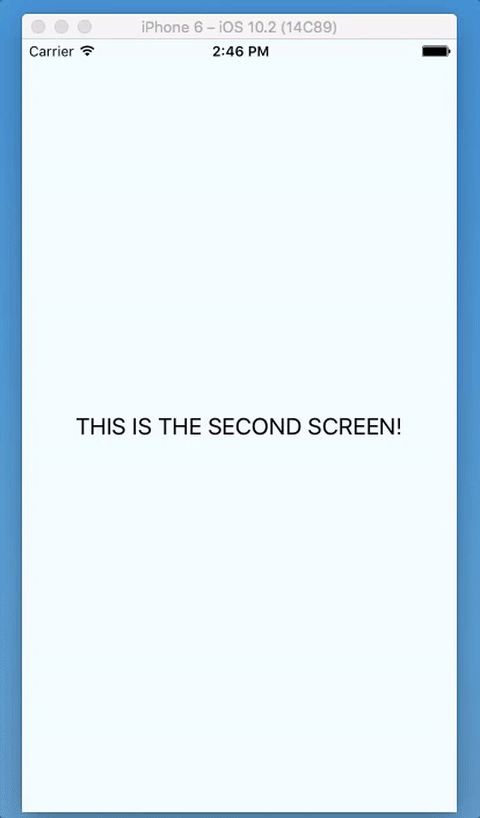
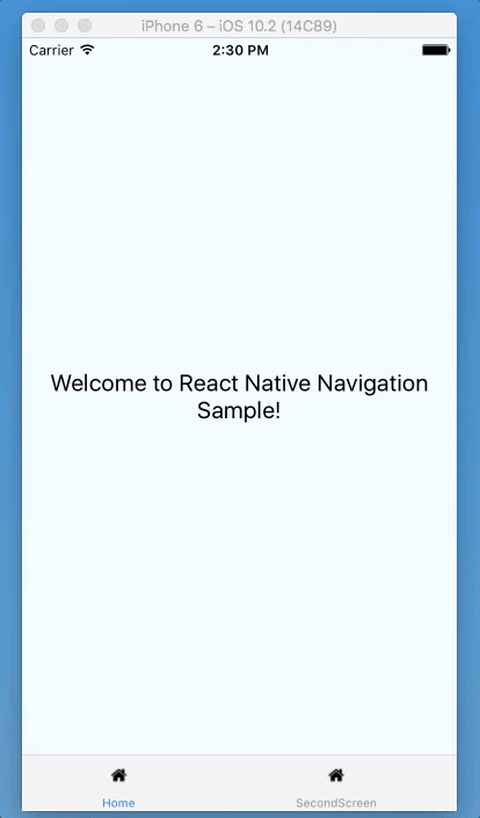
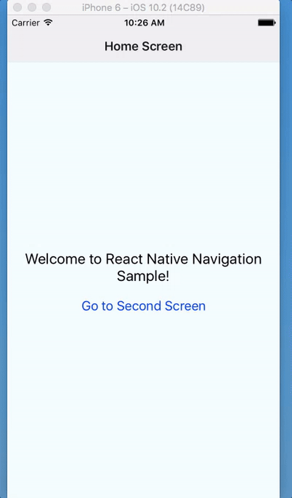

# react-native-navigation-sample
This is a sample of how to use [React Navigation](https://reactnavigation.org/).

## Drawer Navigator

[Example](https://github.com/dailydrip/react-native-navigation-sample/releases/tag/add-drawer-navigation)

## Tab Navigator

[Example](https://github.com/dailydrip/react-native-navigation-sample/releases/tag/add-tab-bar-navigation)

## Stack Navigator

[Example](https://github.com/dailydrip/react-native-navigation-sample/releases/tag/stack-navigator-two-screens)

### About DailyDrip

>This code is part of [React Native
>Drips](https://www.dailydrip.com/topics/react-native/), a daily and continous
>learning website where you can just spend 5min a day and learn things.
